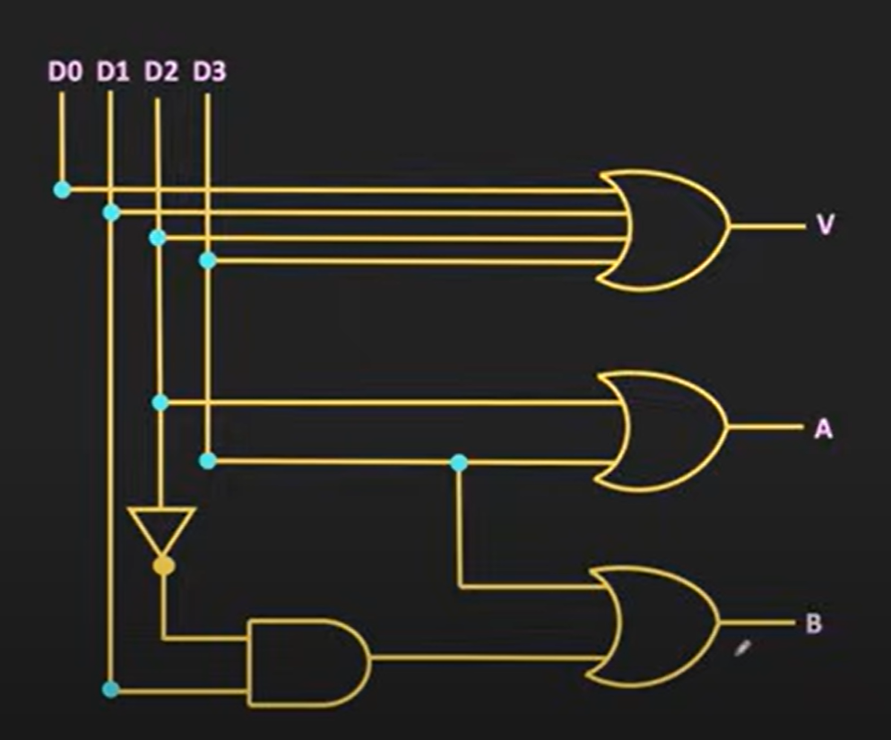
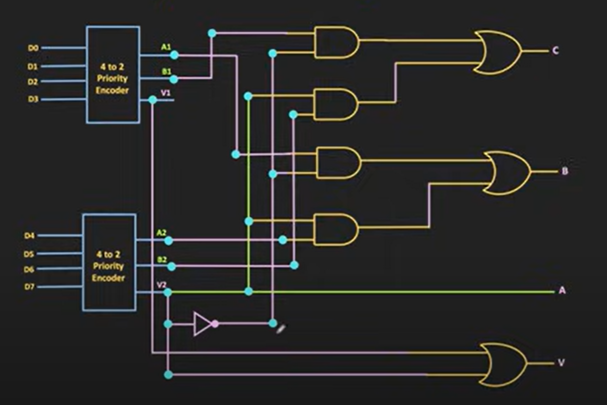

# Reversible Priority Encoder – Qiskit

Implementation of reversible priority encoders **(4→2 and 8→3)** using Qiskit, simulated on the QASM Simulator and run on a real IBM Quantum device. Built with reversible logic gates (Toffoli / CNOT), ensuring all ancilla qubits are uncomputed and returned to |0⟩, preserving quantum reversibility.

---

## What is a Priority Encoder?

A **priority encoder** takes *n* input lines and produces a binary output encoding the index of the **highest-priority active input**. It also outputs a **valid (V)** flag indicating whether at least one input is active.

| Type  | Inputs | Outputs         |
|-------|--------|-----------------|
| 4→2   | D0–D3  | A, B, V         |
| 8→3   | D0–D7  | A, B, C, V      |

A **reversible** priority encoder additionally guarantees:
- No information is erased (every operation is logically reversible).
- All helper (ancilla) qubits are **uncomputed** back to |0⟩ after use.
- The circuit uses only **CNOT** and **Toffoli (CCX)** gates.

---

## 4→2 Reversible Priority Encoder

### Truth Table

| D3 | D2 | D1 | D0 | A | B | V |
|----|----|----|----|---|---|---|
| 0  | 0  | 0  | 0  | 0 | 0 | 0 |
| 0  | 0  | 0  | 1  | 0 | 0 | 1 |
| 0  | 0  | 1  | X  | 0 | 1 | 1 |
| 0  | 1  | X  | X  | 1 | 0 | 1 |
| 1  | X  | X  | X  | 1 | 1 | 1 |

*(D3 is highest priority, D0 is lowest. X = don't care)*

### Boolean Expressions

```
A = D3 OR D2
B = D3 OR (D1 AND NOT D2)
V = D0 OR D1 OR D2 OR D3
```

### Qubit Mapping (9 qubits)

| Qubit | Role                        |
|-------|-----------------------------|
| q[0]  | Input D0 (lowest priority)  |
| q[1]  | Input D1                    |
| q[2]  | Input D2                    |
| q[3]  | Input D3 (highest priority) |
| q[4]  | Output A                    |
| q[5]  | Output B                    |
| q[6]  | Output V (valid flag)       |
| q[7]  | Ancilla t1 (uncomputed)     |
| q[8]  | Ancilla t2 (uncomputed)     |

### Circuit Description

1. **Compute A** (`q[4]`): Reversible OR of D3 and D2 using the identity `A ⊕ B ⊕ (A·B) = A OR B`.  
   Gates: `CX(D3,A)`, `CX(D2,A)`, `CCX(D3,D2,A)`

2. **Compute B** (`q[5]`): First compute `t1 = D1 AND NOT D2` into ancilla `q[7]` (by temporarily flipping D2, applying Toffoli, restoring D2). Then compute reversible OR of D3 and t1 into B. Finally **uncompute t1** to restore `q[7]` to |0⟩.

3. **Compute V** (`q[6]`): Build an OR-tree:
   - `t1 = D0 OR D1` (into `q[7]`)
   - `t2 = t1 OR D2` (into `q[8]`)
   - `V  = t2 OR D3` (into `q[6]`)
   - Uncompute `t2` then `t1` in reverse order.

### Circuit Diagram



---

## 8→3 Reversible Priority Encoder

### Truth Table (partial – shows highest active input)

| Highest Active | D7–D0    | C | B | A | V |
|----------------|----------|---|---|---|---|
| None           | 00000000 | 0 | 0 | 0 | 0 |
| D0             | 00000001 | 0 | 0 | 0 | 1 |
| D1             | 0000001X | 0 | 0 | 1 | 1 |
| D2             | 000001XX | 0 | 1 | 0 | 1 |
| D3             | 00001XXX | 0 | 1 | 1 | 1 |
| D4             | 0001XXXX | 1 | 0 | 0 | 1 |
| D5             | 001XXXXX | 1 | 0 | 1 | 1 |
| D6             | 01XXXXXX | 1 | 1 | 0 | 1 |
| D7             | 1XXXXXXX | 1 | 1 | 1 | 1 |

*(D7 is highest priority. X = don't care)*

### Boolean Expressions

The 8→3 encoder is built from two cascaded 4→2 modules:

```
Lower group:  {D0,D1,D2,D3} → A1, B1, V1
Upper group:  {D4,D5,D6,D7} → A2, B2, V2

C_out = V2
B_out = B2 OR (B1 AND NOT V2)
A_out = A2 OR (A1 AND NOT V2)
V_out = V1 OR V2
```

*(If the upper group has any active input, V2=1 and its encoded value takes precedence.)*

### Qubit Mapping (20 qubits)

| Qubits     | Role                                      |
|------------|-------------------------------------------|
| q[0]–q[7]  | Inputs D0–D7                              |
| q[8]       | A1 – lower 4→2 output A                  |
| q[9]       | B1 – lower 4→2 output B                  |
| q[10]      | V1 – lower 4→2 valid flag                |
| q[11]      | A2 – upper 4→2 output A                  |
| q[12]      | B2 – upper 4→2 output B                  |
| q[13]      | V2 – upper 4→2 valid flag                |
| q[14]      | Ancilla t1 (shared, uncomputed)           |
| q[15]      | Ancilla t2 (shared, uncomputed)           |
| q[16]      | Final output A                            |
| q[17]      | Final output B                            |
| q[18]      | Final output C                            |
| q[19]      | Final output V                            |

### Circuit Description

1. **Lower 4→2 module**: Apply the reversible 4→2 encoder on inputs D0–D3, producing intermediate outputs A1, B1, V1 in `q[8,9,10]`. Ancillas `q[14,15]` are used and uncomputed.

2. **Upper 4→2 module**: Apply the same reversible 4→2 encoder on inputs D4–D7, producing A2, B2, V2 in `q[11,12,13]`. Ancillas `q[14,15]` are reused (they were restored to |0⟩).

3. **Combine outputs**:
   - `C_out` (`q[18]`): Direct copy of V2 via `CX(V2, C_out)`.
   - `B_out` (`q[17]`): Compute `NOT V2` into ancilla `q[14]`, then `t2 = B1 AND NOT V2`, then `B_out = B2 OR t2`. Uncompute in reverse.
   - `A_out` (`q[16]`): Same pattern — `A_out = A2 OR (A1 AND NOT V2)`. Uncompute in reverse.
   - `V_out` (`q[19]`): Reversible OR of V1 and V2.

4. **Measure** outputs A, B, C, V into classical bits `c[0]–c[3]`.

### Circuit Diagram



---

## Files

| File | Description |
|------|-------------|
| `priority_encoder_qasm.ipynb` | 4→2 and 8→3 encoders simulated on Qiskit QASM Simulator |
| `priority_encoder_realdevices.ipynb` | Same encoders executed on a real IBM Quantum device |

---

## Gate Usage

| Encoder | Gate Types Used         | Ancilla Qubits |
|---------|-------------------------|----------------|
| 4→2     | CNOT, Toffoli (CCX), X  | 2 (uncomputed) |
| 8→3     | CNOT, Toffoli (CCX), X  | 2 (uncomputed, reused across modules) |

---

## Requirements

```
qiskit
qiskit-aer
qiskit-ibm-runtime
matplotlib
```
